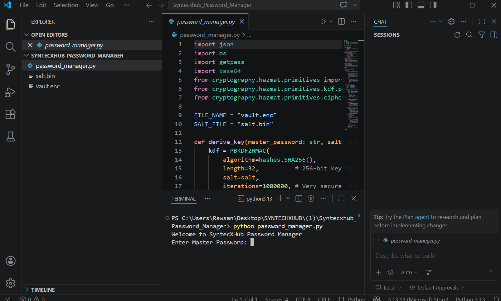
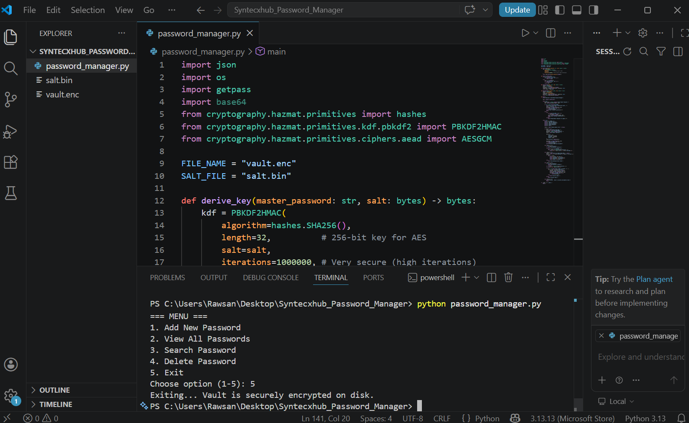
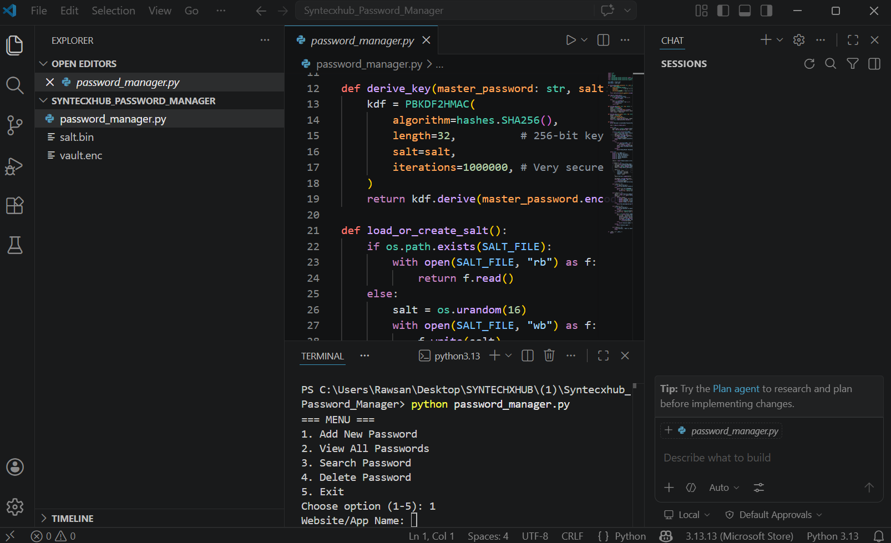
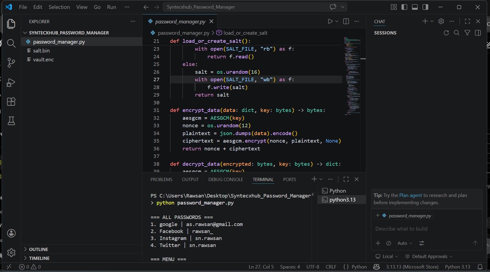
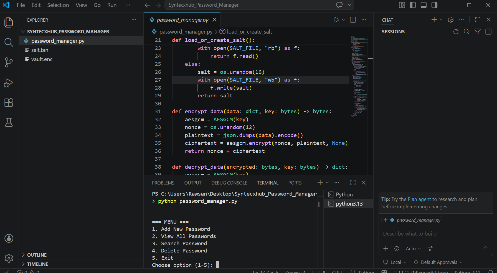
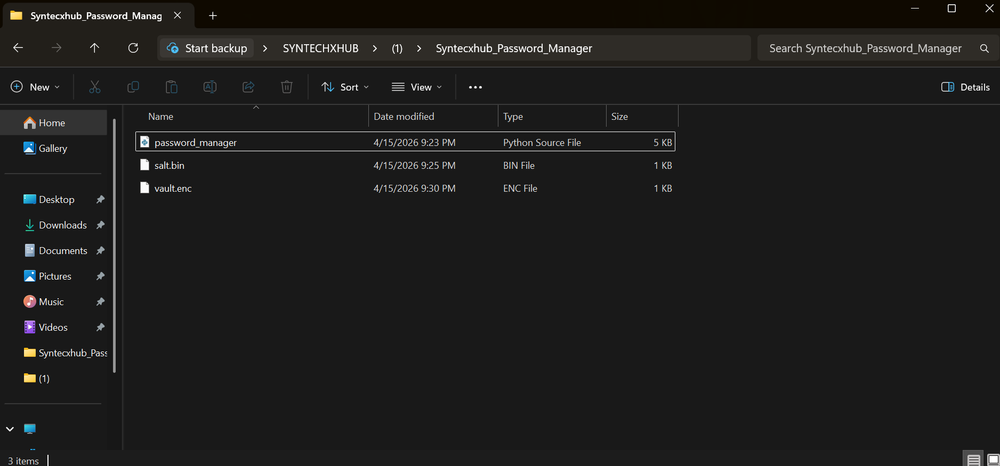

# 🔐 SyntecXHub Password Manager

**Project - 2 | Cybersecurity Internship Week 1 | J.M.Rawsan | Thank you @Syntecxhub for this opportunity!**

A secure **local password manager** that stores all credentials encrypted on disk using strong symmetric encryption.

---

## 📋 Project Requirements: 

- ✅ Built a local password manager that stores credentials encrypted on disk  
- ✅ Used strong symmetric encryption (**AES-256-GCM**)  
- ✅ Secure key handling with **PBKDF2** (1,000,000 iterations)  
- ✅ Implemented **Add, Retrieve (View), Delete, and Search** password entries  
- ✅ Master password protection  
- ✅ Secure local storage format (encrypted JSON vault)

---

## ✨ Features

- Master password authentication  
- Add new password entries (Website, Username, Password, Notes)  
- View all saved passwords  
- Search passwords by website/app name  
- Delete specific password entries  
- All data encrypted on disk – never stored in plain text  
- Automatic vault creation on first use  

---

## 🛠️ Technologies Used

- **Python 3**  
- **cryptography** library (AES-GCM + PBKDF2HMAC)  
- JSON for data structure  
- File-based secure storage (`vault.enc` + `salt.bin`)

---

## 🚀 How to Run

1. Clone the repository:
   ```bash
    pip install cryptography
    python password_manager.py
   
   git clone https://github.com/J-M-Rawsan/Syntecxhub_Password_Manager.git
   cd Syntecxhub_Password_Manager


 ## 📸 Screenshots












